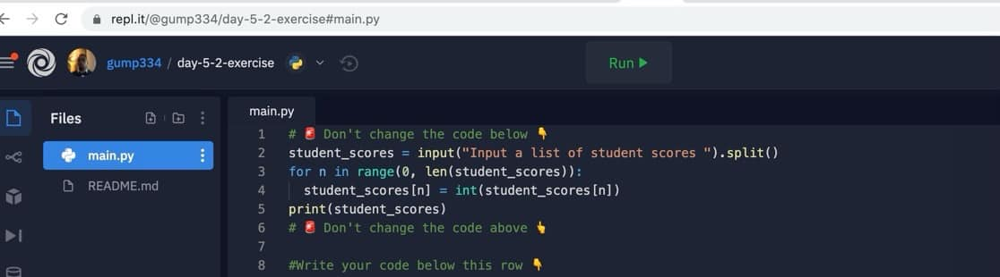

# Get Highest Score

## Overview

A coding challenge was presented to write code to get the highest score from a list without using built in functions.

## Challenge Details

You have to find the highest number in the list without using built in functions. 
Who’s down for this challenge? Doesn’t matter what programming or scripting language that you use.

## Starting Screenshot

